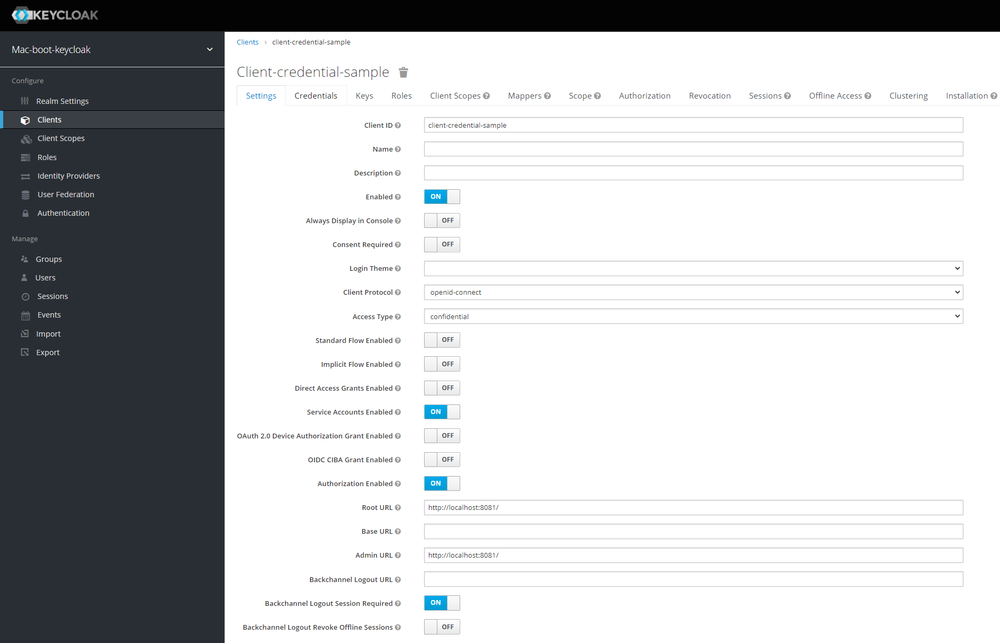

## mac-boot-keycloak-clientcredential

## Authorization Server
1. Start Keycloak
```
docker run -p 8080:8080 -e KEYCLOAK_USER=admin -e KEYCLOAK_PASSWORD=admin quay.io/keycloak/keycloak:15.0.0
```
2. Create a new Realm `mac-keycloak`
3. Create a new Client `mac-client-credential-sample`
4. Configure Client as below
  

## Client App
* Get Token
```
curl --location --request POST 'http://localhost:8080/auth/realms/mac-keycloak/protocol/openid-connect/token' \
--header 'Content-Type: application/x-www-form-urlencoded' \
--data-urlencode 'grant_type=client_credentials' \
--data-urlencode 'client_id=mac-client-credential-sample' \
--data-urlencode 'client_secret=11111111-1111-1111-1111-111111111111'
```
* Call API
```
curl --location --request GET 'http://localhost:8081/private/hello' \
--header 'Authorization: Bearer XXXXX' 
```

## Reference 
* https://docs.spring.io/spring-security/site/docs/current/reference/html5/#oauth2resourceserver
